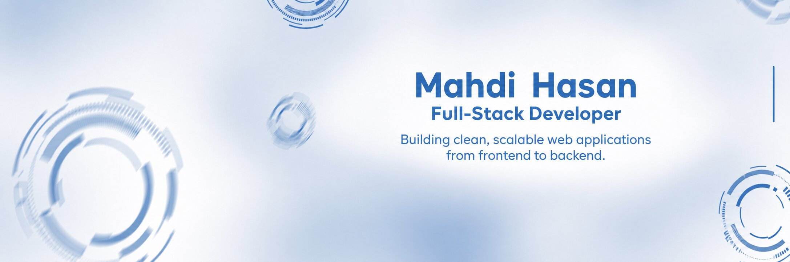

 

## 👋 Glad to see you here!

---

### 🙋 About Me

I'm a **Full-Stack Developer** who enjoys understanding how a product works end to end — from the interface users interact with to the APIs, database, and backend logic behind it.

I work mainly with **React, Next.js, Node.js, Express, TypeScript, PostgreSQL, and Prisma**, building responsive interfaces and practical backend features for real-world applications.

I care about writing code I can understand and explain, solving problems properly, and building features that are **clean, maintainable, and useful** in a real product.

 

---

### 🎯 Currently Focused On

<table>
  <tr>
    <td valign="middle" width="62%">
      
🧩 Building full-stack features with React, Next.js, Node.js &amp; Express

      
🗄️ Working with PostgreSQL &amp; Prisma for backend data flows

      
🔐 Implementing authentication, role-based access &amp; protected routes

      
💳 Building subscription, payment &amp; third-party integration flows

      
⚡ Working on real-time features with Socket.IO

    </td>
    <td valign="middle" width="38%" align="center">
      
    </td>
  </tr>
</table>

---

### 🛠️ Tech Stack

**⚙️ Core**

  

**🔧 Supporting Tools**

  

---

### 📊 GitHub Stats

<table>
  <tr>
    <td>
      
    </td>
    <td>
      
    </td>
  </tr>
</table>

 

 

